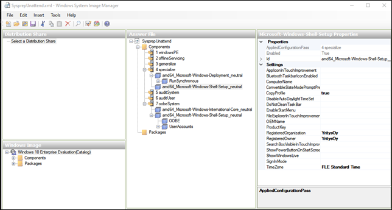

# Ohje mallikoneen tekemiseen
Ohjeet 
1. Suoritetaan windows 10 perusasennus (osan valinnoista voi ohittaan CTRL+shift+F3 jollain mennään auditmodeen)  
2. ladataan ja asennetaan windows updaten päivitykset ja tarvittaessa joitain sovelluksia (tarvittaessa myös BGinfo).  
3. windows ADK-ohjelman asennus 
4. unattend.xml ladataan ja sitä aletaan muokkaamaan Windows System Image Managerilla.
5. vaikkapa tämmöisillä asetuksilla

6. nimetään tiedosto SysprepUnattend.xml ja siirretään se uudentyöaseman tietokoneen kansioon C:\Windows\System32\Sysrep kansioon.  

7. lopuksi suoritetaan komento: sysprep /generalize /oobe /shutdown /unattend:sysprepunattend.xml
